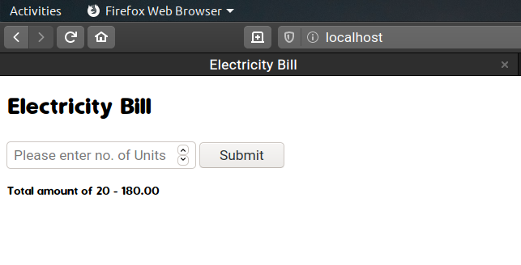
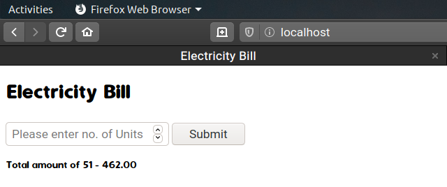
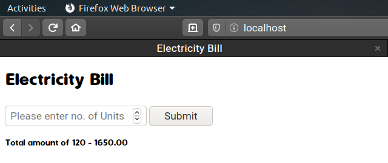

# PHP-Electericity-Bill-Calculator

Simple PHP program for demonstration the basics of PHP.

## Problem Statement
```
You are required to print electricity bill for the no of unit. Units must be given as an
input by the user, it will print the electricity bill using: i. For first 50 units, it will
charge Rs 9 per unit ii. For next 50 units, it will charge Rs 12 and iii. Above it, it will
charge Rs 15.

```
### Solution:
PHP is scripting langauage which does run directly on browser. for running them you need to setup a server or use online server. For local server we will be using **apache** and **php**.

## Prerequisites
* Apache
* PHP

## Installing Prerequisites

For Apache
```
sudo apt-get install apache2
```
For PHP
```
sudo apt-get install php

```
## Steps to Run the Code
* After installing apache2. 

**Step:1**  
Saving the old page of apache welcome.(Incase you may need that in future.)
Open the terminal and execute this.
```
sudo mv /var/www/html/index.html /var/www/html/index.back

``` 
**Step:2**  
Make a PHP file to writre code in it.

```
sudo gedit /var/www/html/index.php

```

**Step:3**


Now open the the index.php shared file and copy the codes from it and paste it.

or

You can skip **Step: 2** and copy the file directly into the html folder.

```
sudo cp index.php /var/www/html/

```
**Step:4**   
Restart Apache 

```
sudo systemctl restart apache2

```
## Running the tests

* Open Your Browser and Enter localhost into address bar.

```
localhost 

```
it should open a file like this
<br />
<br />

<br />
<br />

* If the Unit is less than 50 then it should charge 9₹
``` Given Units = 20
    so cost will be 20x9 = 180₹
    
 ```


<br />
<br />
* If the Unit is greater than 50 but less than 100 then it should charge 9₹ for first 50 and 12₹ for the remaining units.

```
Given Units=51
so cost will be (50x9)+(1x12)= 462₹

```


<br />
<br />

* If the Unit greater than 100 so it should cost 9₹ for first 50 units, 12₹ for next 50 units and 15₹ for remaining units..

```
Given Units=
so cost will be (50x9)+(50x12)+(20x15)= 1650₹

```



